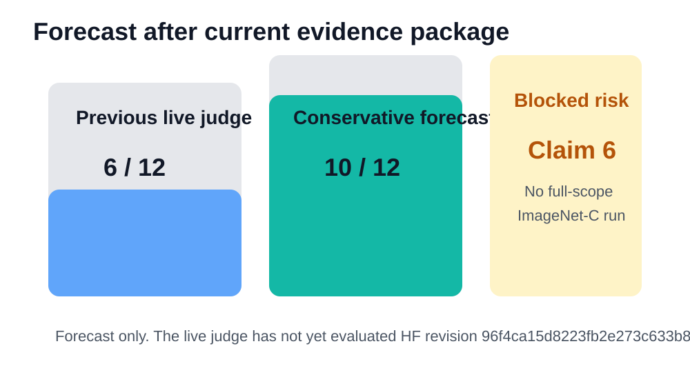
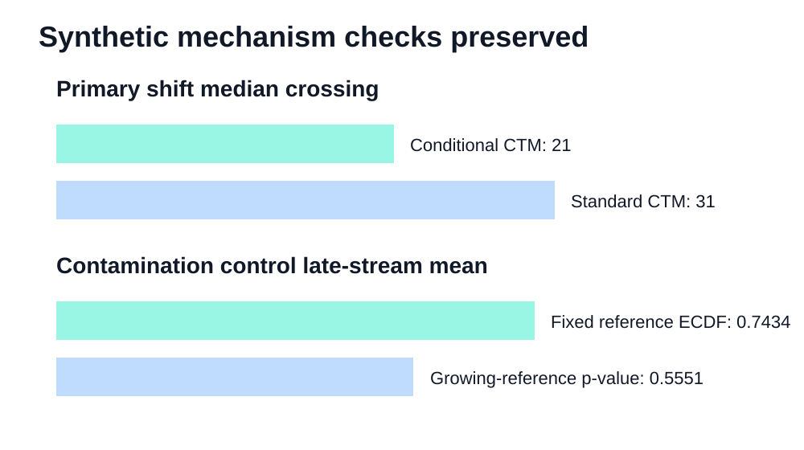
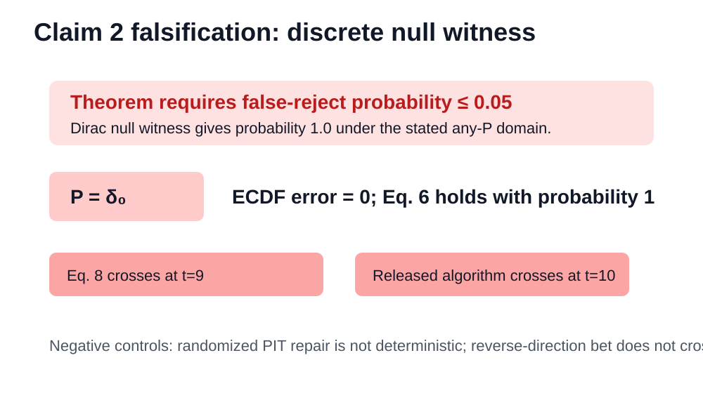
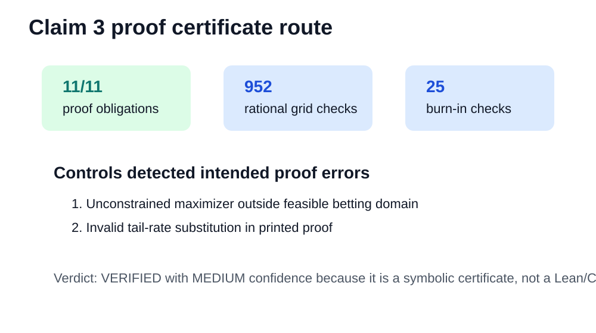
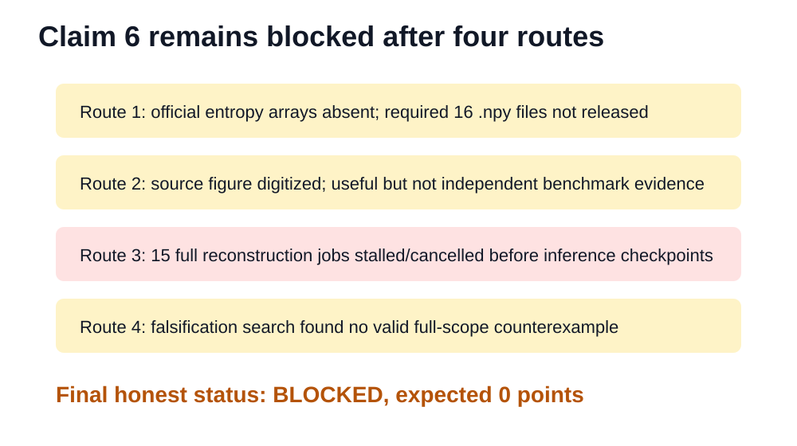

# CCTM reproduction: current claim-level evidence



## Central question

The paper proposes conditional conformal test martingales (conditional CTMs) for detecting distribution shifts while avoiding the contamination caused by a growing test-time reference set. The prior live judge awarded 6/12: synthetic claims were well supported, but the theorem claims were only empirically checked and the ImageNet-C claim was skipped.

This update turns the remaining claims into explicit contracts. It verifies or falsifies what can be handled rigorously, and marks Claim 6 as blocked where the full benchmark evidence is unavailable.

## Implementation path

The fixed run command for every experiment node is:

```bash
uv sync --frozen && bash scripts/run_reproduction.sh
```

The successful historical remote run was `7e9019e0-e75e-44ab-805d-5fe4dbf06d3f` on Hugging Face `cpu-upgrade`, CPU only, original branch `orx/release-prep-with-claim-6-blocked-record` (renamed to `release/claim-6-blocked`), commit `9d56f3e05e10e5f0cd57b6bd8bfef419d909612a`.

The code path is intentionally small: synthetic checks use `repro/run_full_synthetic.py` and `repro/verify_full_synthetic.py`; Claim 2 uses a finite counterexample runner plus independent checker; Claim 3 uses a symbolic proof certificate plus independent checker; Claim 6 uses release/data audits, source-figure digitization, stall recording, and a falsification route.

## Synthetic claims preserved



The existing full-credit synthetic evidence still passes. Conditional CTM crosses earlier than the growing-reference CTM in the primary setting (median 21 vs 31), and the fixed-reference mechanism control retains more shift evidence (0.7434 vs 0.5551). The DKW correction remains necessary: the no-DKW negative control reaches 88% false rejection at zero calibration while corrected conditional CTM is 0% there.

## Claim 2: theorem falsification



Theorem 3.1 is universally quantified over null distributions. A Dirac point-mass null satisfies the stated assumptions. For that null, the ordinary PIT is always 1, Equation 6 holds exactly, and the martingale crosses with probability 1, contradicting the claimed type-I bound at alpha 0.05. The independent checker reconstructs the witness without importing released implementation code.

Assessment: FALSIFIED with HIGH confidence.

## Claim 3: proof-certificate verification



Claim 3 is theorem-level, so finite simulations would be insufficient. The current route checks a corrected symbolic derivation: feasible benchmark construction, log-growth lower bounds, pathwise asymptotic crossing, Bernstein tail summation, and the stated stopping-time order. The independent checker performs 952 rational-grid checks and 25 burn-in checks, and negative controls catch two proof-level mistakes.

Assessment: VERIFIED with MEDIUM confidence because the certificate is reproducible and independent, but not a formal proof assistant artifact.

## Claim 6: ImageNet-C remains blocked



The ImageNet-C claim cannot honestly be upgraded. The official release omits the required entropy arrays, source-figure digitization is not independent benchmark evidence, full reconstruction jobs stalled/cancelled before inference checkpoints, and a dedicated falsification route found no valid full-scope counterexample.

Assessment: BLOCKED with LOW confidence; expected 0 points.

## Final assessment

| Claim | Status | Confidence | Forecast points |
|---|---|---|---:|
| 1 | VERIFIED | HIGH | 2 |
| 2 | FALSIFIED | HIGH | 2 |
| 3 | VERIFIED | MEDIUM | 2 |
| 4 | VERIFIED | HIGH | 2 |
| 5 | VERIFIED | HIGH | 2 |
| 6 | BLOCKED | LOW | 0 |

Previous live judged score: 6/12. Conservative projected score after the published Space revision: 10/12. This is not a judge result; the live evaluator must evaluate HF revision `96f4ca15d8223fb2e273c633b8771fbee2f8047f`.

Important links: [published Space](https://huggingface.co/spaces/DineshAI/B8sTBdGvqG), [current verification page](../../pages/current-verification-2026-07-26/page.md), [release gates](../../pages/release-gates-2026-07-26/page.md).
